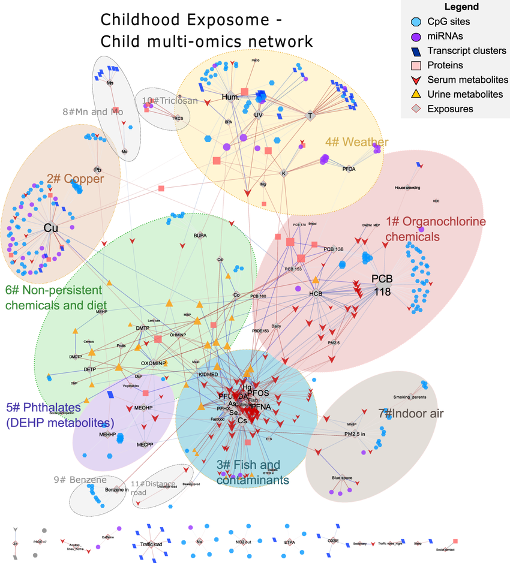

# Multi-Omics Network Integrator

[](https://opensource.org/licenses/MIT)

[](https://github.com/olaflaitinen/Multi-Omics-Network-Integrator/actions/workflows/ci.yml)

A Python tool to integrate transcriptomic (RNA-Seq) and proteomic data with a protein-protein interaction (PPI) network to identify and analyze dysregulated signaling pathways. This project is based on methods developed during my PhD research on neurodegeneration.

### Workflow Overview

The tool scores nodes (genes/proteins) in a background PPI network based on their significance in one or both omics layers. It then identifies "hotspot" subnetworks—highly interconnected regions of the network that are significantly dysregulated.

```
┌────────────────────────┐      ┌────────────────────────┐      ┌────────────────────────┐
│   Transcriptomics      │      │     Proteomics         │      │     PPI Network        │
│ (logFC, p-value)       │      │   (logFC, p-value)     │      │   (e.g., STRING DB)    │
└──────────┬─────────────┘      └──────────┬─────────────┘      └──────────┬─────────────┘
           │                              │                                │
           └───────────────┐  ┌───────────┘                                │
                           ▼  ▼                                            │
                  ┌────────────────────────┐                               │
                  │    Score Nodes & Edges │                               │
                  │ (Integrate Omics Data) │                               │
                  └──────────┬─────────────┘                               │
                           └───────────────┐  ┌────────────────────────────┘
                                           ▼  ▼
                                  ┌──────────────────┐
                                  │   Build Weighted │
                                  │      Graph       │
                                  └────────┬─────────┘
                                           │
                                           ▼
                                  ┌──────────────────┐
                                  │   Find Active    │
                                  │   Subnetworks    │
                                  └────────┬─────────┘
                                           │
                                           ▼
                    ┌─────────────────────────────────────────┐
                    │    Output: Network files, Plots,        │
                    │    Ranked list of dysregulated pathways │
                    └─────────────────────────────────────────┘
```



### Features

-   **Data Integration**: Merges differential expression/abundance results from RNA-Seq and proteomics.
-   **Node Scoring**: Implements a flexible scoring system to weight genes based on their significance in each omic layer.
-   **Network Construction**: Builds a weighted `networkx` graph from a user-provided PPI network.
-   **Subnetwork Analysis**: Identifies connected components and ranks them to find dysregulated signaling "hotspots".
-   **Visualization**: Generates static and interactive network plots using `Matplotlib` and `pyvis`.

### Installation

1.  **Clone the repository:**
    ```bash
    git clone https://github.com/olaflaitinen/Multi-Omics-Network-Integrator.git
    cd Multi-Omics-Network-Integrator
    ```

2.  **Create and activate a virtual environment:**
    ```bash
    python3 -m venv venv
    source venv/bin/activate
    ```

3.  **Install dependencies:**
    ```bash
    pip install -r requirements.txt
    ```

### Usage

There are two ways to use this tool:

#### 1. Command-Line Interface (CLI)

The `main_cli.py` script provides a simple interface for running the full pipeline.

```bash
python main_cli.py \
    --config config/default_config.yaml \
    --rnaseq data/example_rnaseq_results.csv \
    --proteomics data/example_proteomics_results.csv \
    --ppi data/example_ppi_network.tsv \
    --output_dir ./results
```

#### 2. Jupyter Notebook

For a detailed, step-by-step walkthrough with explanations and intermediate visualizations, open and run the `notebooks/analysis_walkthrough.ipynb` notebook. This is the recommended way to get started.

```bash
jupyter-lab notebooks/analysis_walkthrough.ipynb
```

### Methodology

The core of the integration is a node scoring function. For a given gene/protein `i`, its score `S(i)` is calculated as:

`S(i) = w_rna * f(p_rna,i) + w_prot * f(p_prot,i)`

where `w` are user-defined weights for each omic layer, and `f(p)` is a transformation of the p-value (e.g., `-log10(p)`) for significant hits. This score is then used as a node attribute in the PPI network to find high-scoring subnetworks.

### Citation

This tool is an implementation of methods described in:

> Imanov, O. Y. L. (2028). *Thesis: Integrative Network Analysis of Transcriptomic and Proteomic Data to Uncover Dysregulated Signaling Cascades in Early-Stage Neurodegeneration*. University of Luxembourg.
